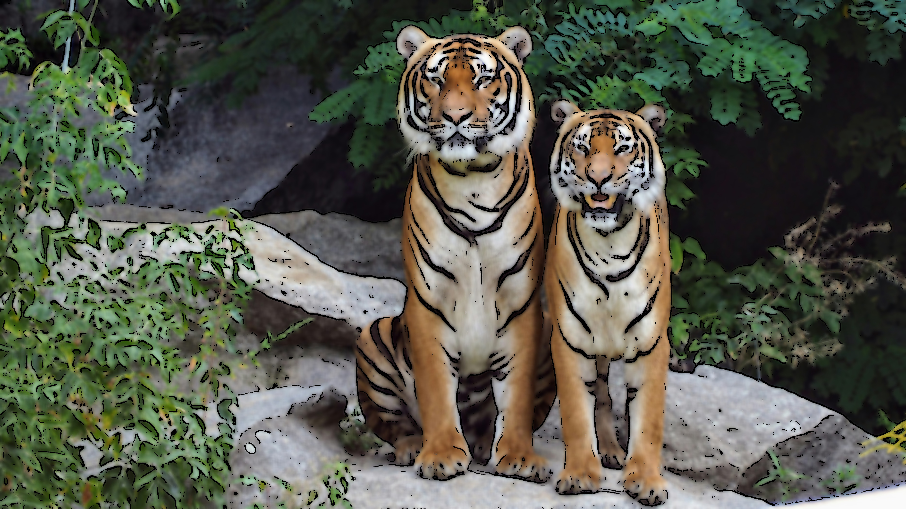
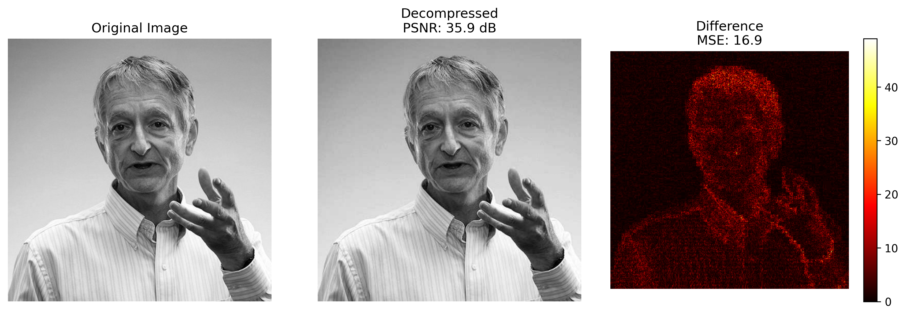

# Image Processing from Scratch

This repo has Python implementations of classic image processing techniques, most of them written by hand with NumPy. They cover intensity transforms, spatial and frequency-domain filters, a JPEG-style codec, morphology and simple shape features.

These are my four programming assignments from the Digital Image Processing course at Sharif University of Technology (Spring 2025). Each folder holds one assignment: a Jupyter notebook with its input images and the outputs it produced.

## 1. Enhancement and spatial filters

[`01-enhancement-and-spatial-filters`](01-enhancement-and-spatial-filters/image_enhancement.ipynb)

- Negative, log and gamma transforms, then a mix of log and gamma to brighten a dark photo
- Histogram specification, which maps one image's histogram onto another's
- Recoloring flowers in HSV space (red to violet, blue to pink, yellow to orange)
- Box, Gaussian and median blur with kernel sizes 3, 11 and 25
- Unsharp masking with a Gaussian kernel built from its formula
- ACE (histogram equalization per block) and CLAHE with my own histogram clipping
- Gaussian and salt-and-pepper noise generators, and a hand-written median filter that removes the salt-and-pepper noise


## 2. Frequency domain and cartoonization

[`02-frequency-domain-and-cartoon`](02-frequency-domain-and-cartoon/frequency_domain_and_cartoon.ipynb)

- DFT of an image with periodic noise, and a notch filter that finds the noise peaks in the spectrum on its own: it takes the brightest points outside the center and adds their mirror images
- 2D DCT, and block-wise DCT with small coefficients zeroed out
- A cartoon effect built from adaptive-threshold edges and a bilateral filter written in NumPy only. A parameter α between 0 and 1 controls how strong the effect is.



## 3. Compression and denoising

[`03-compression-and-denoising`](03-compression-and-denoising)

- [`jpeg_compression.ipynb`](03-compression-and-denoising/jpeg_compression.ipynb) is a small JPEG-style codec. It splits the image into 8×8 blocks, applies the DCT, quantizes with the standard JPEG luminance table and reads each block in zigzag order with an end-of-block marker. Decoding reverses the quantization and applies the inverse DCT. On the 512×512 test image it reaches an MSE of 16.89 and a PSNR of 35.85 dB.
- [`noise_filtering.ipynb`](03-compression-and-denoising/noise_filtering.ipynb) adds salt-and-pepper noise at rates from 0.1 to 1.0, then cleans the 0.1 image with mean and median filters of size 3, 5 and 7. Each filter has a NumPy version and an OpenCV version. Short written answers explain why the median filter handles this noise better.



## 4. Morphology and shape features

[`04-morphology-and-shape-features`](04-morphology-and-shape-features/morphology_and_shapes.ipynb)

- Binary erosion and dilation without OpenCV, used as an opening to clean up a noisy image
- Keeping only the vertical lines, or only the horizontal ones, with line-shaped structuring elements
- Leaf outlines from the morphological gradient and the inner and outer boundaries
- Counting the small coins in a photo with adaptive thresholding, closing and connected components; it finds all 7
- Telling autumn leaves from banana leaves with four shape features (aspect ratio, extent, solidity, circularity) and a one-layer perceptron. There are only six sample images, so treat this as a demonstration of the features.

## Running the notebooks

```bash
python -m venv .venv
source .venv/bin/activate
pip install -r requirements.txt
jupyter notebook
```

Start Jupyter from inside a folder, since each notebook reads and writes images next to itself. The outputs are already saved in the notebooks, so you can read them here without running anything.

The assignment questions and input images came from the course.
